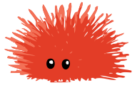

<h1 align=center >
  
   
  D4RKJVCK
</h1>

## LANGUAGES

## TECHNOLOGIES

- 🔭 I’m currently coding at [Zone01 Dakar](https://www.zone01dakar.sn)
- 🦀 I’m currently coding in [RUST](https://doc.rust-lang.org/book)
- 📫 You can reach me on [LinkedIn](https://www.linkedin.com/in/d4rkjvck)

<h3 align=center>
  
</h3>
