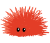

<h1 align=center >
  
   
  D4RKJVCK
</h1>

## LANGUAGES

## TECHNOLOGIES

## TOOLS

## OPERATING SYSTEMS

<h3 align=center>
  
</h3>

- 📫 You can reach me on [LinkedIn](https://www.linkedin.com/in/d4rkjvck)
